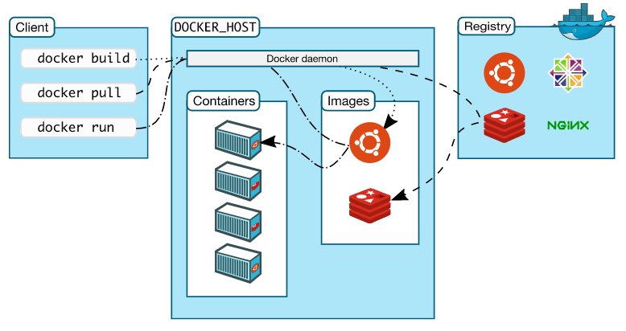
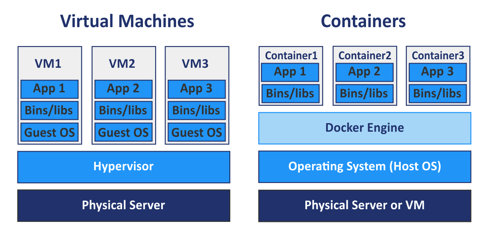
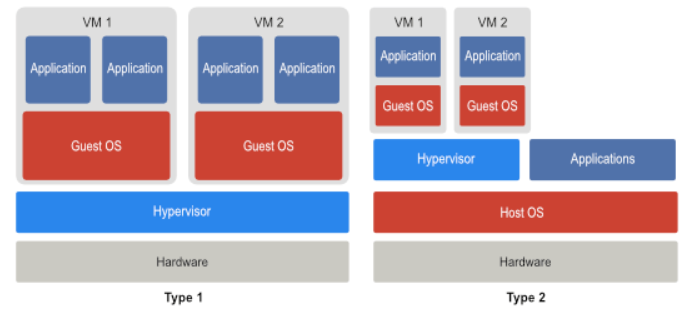

> 

> 도커에 입문하신 분들이라면 Docker 공식 홈페이지에 [Docker Overview](https://docs.docker.com/get-started/overview/)를 읽어보시길 추천드립니다! 👍 

- [[1] Docker](#1-docker)
- [[2] Docker Image와 Container](#2-docker-image와-container)
  - [Docker Image](#docker-image)
  - [Dockerfile](#dockerfile)
  - [Docker Container](#docker-container)
- [[3] Docker Architecture](#3-docker-archittecture)
- [[4] Docker 실습](#4-docker-실습)
  - [Docker 설치](#docker-설치)
  - [Hello World 예제](#hello-world-예제)
- [[5] 가상머신(Virtual Machine)](#5-가상머신vm-virtual-machine과-container)
  - [가상머신](#가상머신vm)
  - [하이퍼바이저](#하이퍼바이저hypervisor)
- [[6] Cgroup과 Namespace](#6-cgroup과-namespace)

_____

# [1] Docker
- 도커는 어플리케이션을 **개발(developing)**하고 **운반(shipping)**하고 **실행(running)**하기 위한 개방형 플랫폼이다.
- **인프라에서 어플리케이션을 분리**하여 소프트웨어를 **빠르게 실행**할 수 있도록 해준다.
- 도커를 활용하여 코드 작성과 배포에서의 실행 사이의 지연을 크게 줄일 수 있다. 

# [2] Docker Image와 Container
## Docker Image
- 도커 이미지는 코드, 런타임, 시스템 도구, 시스템 라이브러리 및 설정과 같은 **응용 프로그램을 실행하는데 필요한 모든 것을 포함하는 가볍고 독립적인 소프트웨어** 패키지이다.
- 도커 공식 홈페이지에서는 'Docker Container를 만들기 위한 지침이 담긴 read-only 템플릿'이라고 정의하고 있다.
- 이미지를 직접 만들 수도 있고, 다른 사람들이 만들어서 레지스트리에 올려 둔 이미지를 사용할 수도 있다.

## Dockerfile
- 도커 이미지를 직접 만들기 위해서는 Dockerfile을 만들어야한다.
- Dockerfile의 하나의 명령어는 이미지에서 하나의 레이어(layer)를 만든다.
- Dockerfile을 변경하고 이미지를 재빌드 하면 **변경사항이 있는 레이어만 재빌드**된다. 이는 가상화 기술과 비교했을 때 이미지가 작고 가볍고 빠른 이유이다.

## Docker Container
- 도커 컨테이너는 **도커 이미지의 실행가능한 인스턴스**이다.
- 코드와 모든 종속성을 패키지화하여 응용 포로그램이 한 컴퓨팅 환경에서 다른 컴퓨팅 환경으로 빠르고 안정적으로 실행되도록 하는 소프트웨어의 표준 단위이다.
- 도커 이미지로 어떻게 도커 컨테이너를 만드는 지에 대해서는 [[7]](#7-이미지로-컨테이너-만드는-방법)에서 설명한다.

# [3] Docker Architecture

- 도커는 **클라이언트-서버 아키텍처**다.
- **도커 클라이언트**(`docker`)에 명령어를 입력하면 **도커 서버**(= **도커 데몬**, `dockerd`)에서 요청을 처리한다.

# [4] Docker 실습
## Docker 설치
1. [Docker](https://www.docker.com/get-started)에서 운영체제에 맞게 설치를 받는다.
2. [Docker Hub](https://hub.docker.com/signup)에서 계정을 생성한다.
3. 터미널에 `docker version`명령어로 설치를 확인한다.

## Hello World 예제
1. 도커 클라이언트에 `docker run hello-world` 명령을 입력한다.
2. 도커 서버에서 요청을 받는다.
3. **이미지 캐쉬(Image Cache)**에 `hello-world` 이미지가 있는지 확인한다.
4. 있으면 이미지 캐쉬에서 가져오고, 없으면 **도커 허브(Docker Hub)**에서 가져온다.

# [5] 가상머신(VM, Virtual Machine)과 Container

## 가상머신(VM)
- 가상화 기술이 출현하기 이전에는 한 대의 서버에 하나의 운영체제, 하나의 프로그램만을 운영하고 사용하였는데, 이는 안정적이지만 비효율적이였다.
- 가상머신은 하이퍼바이저(Hypervisor)를 기반으로 한다.

### 하이퍼바이저(hypervisor)
- 하이퍼바이저는** 호스트 시스템에서 다수의 게스트 OS를 구동**할 수 있게 해주는 소프트웨어이다.
- 하드웨어와 다수의 VM사이를 모니터링 하는 중간 관리자 역할을 한다.
- 각 VM에 **독립된 가상 하드웨어 자원을 할당**하여 **논리적으로 공간을 분리**하기 때문에 한 VM에 오류가 발생해도 다른 VM에는 영향을 미치지 않는다.

#### 제 1형 하이퍼바이저
   - **네이티브(Nativie) 하이퍼바이저** 혹은 **베어메탈(Bare Metal) 하이퍼바이저**라고 불린다.
   - 하이퍼바이저가 **하드웨어를 직접 제어**한다.
   - 장점: 자원을 효율적으로 사용할 수 있고, 별도의 호스트 OS가 없으므로 오버헤드가 적다.
   - 단점: 여러 하드웨에 드라이버를 세팅해야 하므로 설치가 어렵다.

#### 제 2형 하이퍼바이저
   - **호스트형(Hosted) 하이퍼바이저**라고 불린다.
   - 일반적인 소프트웨어처럼 전통적인 **OS 위에서 실행**되며 일반적으로 많이 이용하는 방법이다.
   - 장점: OS 종류에 대한 제약이 없고 구현이 다소 쉬운 편이다.
   - 단점: 오버헤드가 크다.

## VM과 Container의 비교
- 공통점: 기본 하드웨어에서 격리된 환경 내에 어플리케이션을 배치한다.
- 차이점
  - 가상머신: 가상머신을 실행 -> 자원 할당 -> 게스트 OS 부팅 -> 어플리케이션 실행(복잡)
  - 컨테이너: 호스트 OS위에 어플리케이션의 이미지 배포(간단), 커널 공유

# [6] Cgroup과 Namespace
######  *도커 컨테이너들은 어떻게 격리시키는거야?*

- Cgroup과 Namespace는 컨테이너와 호스트에서 실행되는 **다른 프로세스 사이에 벽을 만드는** 리눅스 커널 기능들이다.
- Cgroup(Control Group): CPU, 메모리, 네트워크 대역폭(Network Bandwidth), HD I/O 등 시스템 리소스 사용량을 관리한다.
- Namespace: 하나의 시스템에서 프로세스를 격리시킬 수 있는 경량 프로세스 가상화 기술

###### *리눅스 커널 기능인 Cgroup과 Namespace를 Docker 환경에서 사용할 수 있나?*
- YES, 리눅스 vm이 설치되기 때문에 리눅스 커널을 사용할 수 있다.
- 터미널에 `docker version`을 입력해보면 os 항목에 linux라고 나온다.

# [7] Docker Image로 Container 만드는 방법
- 이미지는 응용 프로그램을 '실행하는데 필요한 모든 것'을 포함하고 있다.
  - 1) 컨테이너가 **시작**될 때 실행되는 **명령어**
  - 2) **파일 스냅샷**(디렉토리나 파일을 카피한 것)

1. 도커 클라이언트에 `docker run <image>`를 입력한다.
2. 도커 이미지에 있는 파일 스냅샷을 컨테이너 하드 디스크에 옮겨 둔다.
3. 이미지에 가지고 있는 명령어를 이용해서 응용 프로그램을 실행시킨다.

# 출처
- [https://docs.docker.com/get-started/overview/](https://docs.docker.com/get-started/overview/)
- [https://superuser.com/questions/1553794/are-hardware-drivers-needed-to-be-installed-on-the-management-os-of-a-type-1-hyp](https://superuser.com/questions/1553794/are-hardware-drivers-needed-to-be-installed-on-the-management-os-of-a-type-1-hyp)
- [https://www.nakivo.com/blog/docker-vs-kubernetes/](https://www.nakivo.com/blog/docker-vs-kubernetes/)