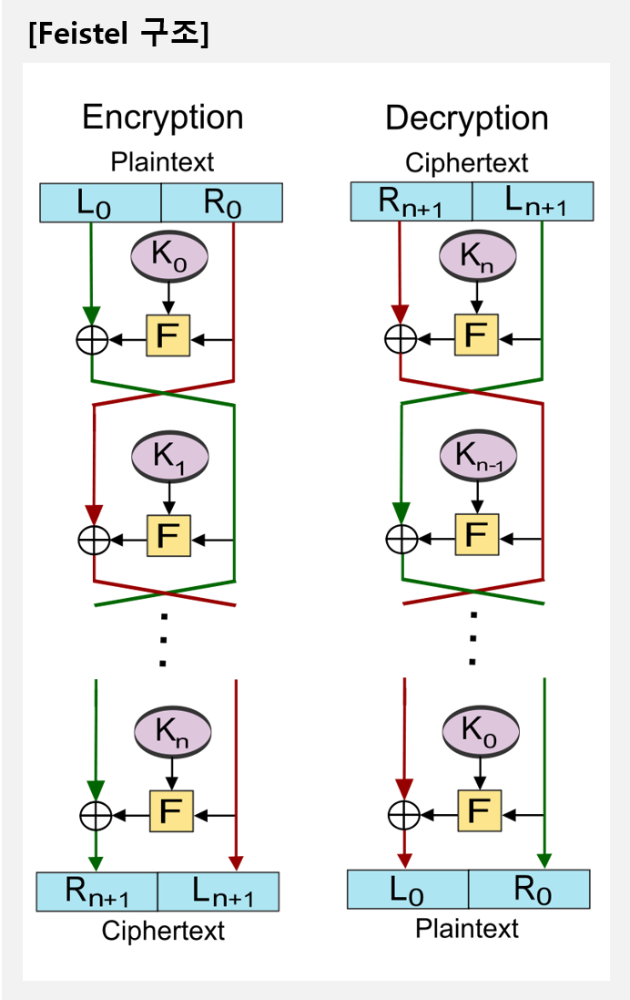
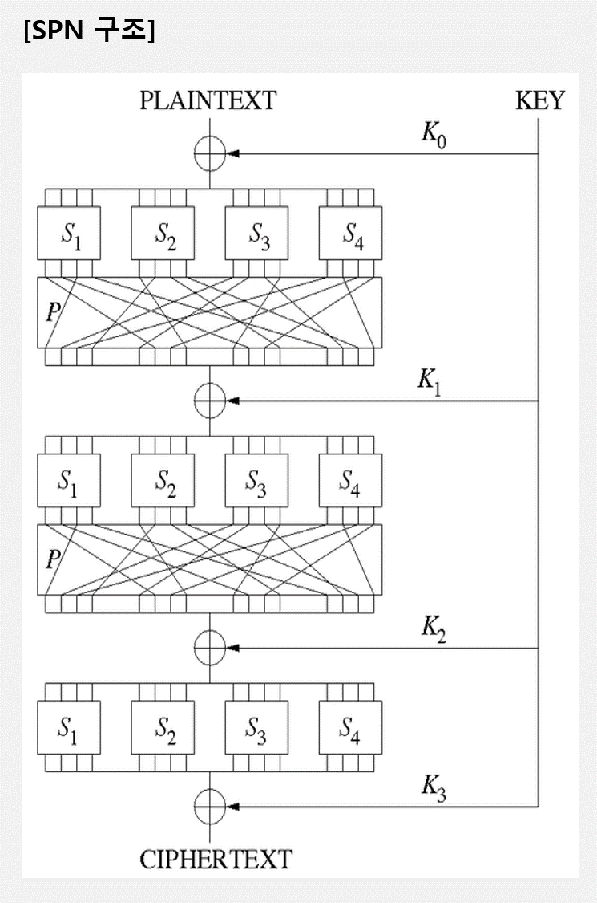
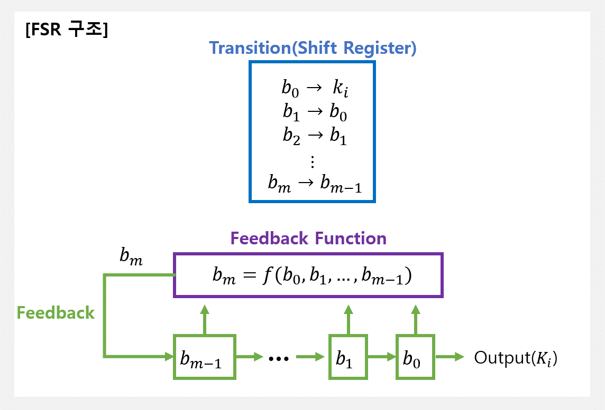
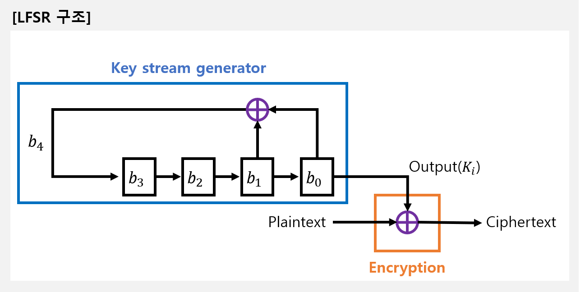

> 알기사 교재 - section 03. 대칭키 암호

# 1. 현대 대칭키 암호
_____
`현대 블록 암호` : **이동요소(Shift), 교환요소(Swap), 분할요소(Split), 조합요소(Combination), 전치장치(P-Box), 치환장치(S-Box), XOR의 조합**으로 만들어짐
## 현대 블록 암호
### 개념 (합성 암호)
- 현대 블록 암호는 모두 합성 암호
- `현대 블록 암호` : **이동요소(Shift), 교환요소(Swap), 분할요소(Split), 조합요소(Combination), 전치장치(P-Box), 치환장치(S-Box), XOR의 조합**으로 만들어짐
- `P-Box` : 고전 전치 암호를 병렬적으로 수행
  1. 단순 P-Box
    - 역함수 존재 
  2. 축소(Compression) P-Box : n비트 입력, m비트 출력에서 n > m
    - 역함수 존재하지 않음
  3. 확장(Expansion) P-Box : n비트 입력, m비트 출력에서 n < m
    - 역함수 존재하지 않음
- `S-Box` : 치환 암호의 축소 모형으로 생각할 수 있음
  - n비트 입력, m비트 출력에서 n=m이 아닐 수 있음
- `합성 암호(Product Ciphers)` : 치환, 전치, 그 외의 구성요소를 결합한 복합적인 암호
  - `확산(Diffusion)` : **C**와 **P**사이의 관계를 숨기는 것. **C를 통해 P를 찾고자 하는 공격자를 좌절**시킴
  - `혼돈(Confusion)` : **C**와 **K**사이의 관계를 숨기는 것. **C를 통해 K를 찾고자 하는 공격자를 좌절**시킴
  - `라운드(Rounds)` : **반복적으로 사용하는 합성 암호**

### 분류
1. `Feistel(페이스텔) 암호`
    - Feistel 구조에서 '네트워크'는 구성도가 그물을 짜는 것처럼 교환되는 형태를 의미
    - 암호강도에 있어 안정성을 보장받기 위해서는
      - **P블록의 길이는 16비트(최근에는 128비트)**
      - **K의 길이는 64비트 내외(최근에는 128비트)**
      - **R은 16회 이상**
    - 구조
      - 라운드 함수를 F, 라운드키를 Ki라 할 때, i번째 라운드 과정은
        - Li = Ri-1
        - Ri = Li-1 &oplus; Fi(Ri-1, Ki)
        - 최종 라운드에서는 좌우 블록을 한 번 더 교환해야함
  
      
    - 장점 : 알고리즘 수행속도가 빠르고, 구현이 용이, 아직까지 구조상의 문제점 발견하지 못함
 
2. `SPN 구조(Substitution Permutation Network)`
    - 여러 개의 함수를 중첩하면 개별 함수로 이루어진 암호보다 안전하다는 이론에 근거
    - 구조 : 입력을 여러 개의 소블록으로 나누어 S-Box에 입력하고, S-Box의 출력을 다시 P-Box의 입력하는 과정을 반복

    

### 공격
1. `차분 분석(차분 해독법, Differential Cryptanalysis)` : **'평문의 일부를 변경하면 암호문이 어떻게 변화하는가?'**를 조사하는 암호 해독법
    - 블록 암호에서는 평문이 한 비트라도 달라지면 암호문은 전혀 다른 비트 패턴으로 변화하는데, 이 암호문의 변화 형태를 조사하여 해독하는 것
2. `선형 분석(선형 해독법, Linear Cryptanalysis)` : **'평문과 암호문 비트를 몇 개 정도 XOR해서 0이 되는 확률을 조사'**하는 해독 방법
    - 마츠이가 개발
    - 암호문이 충분히 랜덤하게 되어 있으면, 평문과 암호문의 비트를 몇 개 XOR한 결과가 0이 되는 확률은 1/2일 것이므로 1/2에서 크게 벗어나는 비트의 갯수를 조사하여 키에 관한 정보를 얻는 것
3. `전수공격법(Exhaustive Key Search)` : 암호화할 때 일어날 수 있는 **가능한 모든 경우**에 대하여 조사하는 방법 
    - Diffie와 Hellman이 제안
    - 경우의 수가 많은 경우에는 실현 불가능한 방법
4. `통계적 분석(Statistical Analysis)` : 알려진 **모든 통계적인 자료**를 이용하여 해독하는 방법
5. `수학적 분석(Mathematical Analysis)` : 통계적인 방법을 포함하며 **수학적 이론**을 이용하여 해독하는 방법

## 현대 스트림 암호
### 개념
- 관심사 : K 스트림 K = Kn...K2K1를 어떻게 생성할 것인가
- 설계 시 고려사항
  - **암호화의 연속은 긴 주기**를 가져야 함
  - **키 스트림은 진 난수 스트림과 최대한 비슷**해야 함
  - **전사적 공격에 대응하기 위해서는 키가 충분히 길어야 함**
 
### 분류
1. `동기식 스트림 암호` : K 스트림은 P 혹은 C 스트림과 **독립적**으로 생성되고 사용됨
    1. `One-Time Pad` : 암호화를 수행할 때마다 **랜덤하게 선택된 키 스트림을 사용**
        - 이론적으로 해독 불가능하다고 샤논이 수학적으로 증명함
        - **암호화, 복호화 알고리즘은 서로 역관계이며, 배타적 논리합 연산을 사용**
    2. `귀환 시프트 레지스터(FSR, Feedback Shift Register)`
        - **One-Time Pad의 절충안**
        - SW와 HW환경에서 모두 구현될 수 있지만, **HW구현이 더욱 용이**
        - **시프트 레지스터와 귀환 함수**로 구성됨

        
    3. `선형 귀환 시프트 레지스터(LFSR, Linear Feedback Shift Register)`
        - **HW로 쉽게 구현**
        - **많은 스트림 암호가 LFSR를 이용**

        
    4. `비선형 귀환 시프트 레지스터(NLFSR, Nonlinear Feedback Shift Register)`
        - 선형성 때문에 공격에 취약한 **LFSR보다 안전하게 설계**할 수 있음
2. `비동기식 스트림 암호` : K 스트림의 각 비트는 이전의 P나 C에 **종속적**으로 결정됨 

_____
# 2. DES(Data Encryption Standard)
### DES 역사
- 발표된 이후 가장 널리 사용되는 대칭키 블록 암호
- 미국 국립기술표준원은 3중 DES(DES를 세 번 반복)의 사용을 권고하는 새로운 표준 FIPS 46-3을 발표
- 최신 블록암호 표준인 AES는 오랫동안 사용된 DES를 대체하기 위하여 표준으로 제정된 알고리즘

### DES 구조
- **Feistel이 변형된 형태**
- **P의 길이는 64비트, K의 길이는 56비트(48비트의 서브키 16개 생성), R 횟수는 16회**
- **2개의 전치(P-Box)**(초기 전치와 최종 전치)와 **16개의 Feistel 라운드 함수**로 구성
- 암호화와 복호화에서 라운드 키는 역순으로 적용됨

### 라운드 함수
- DES는 16번의 Feistel 암호로 되어 있는 라운드 함수를 사용
- 초기 전치 박스의 출력 값 Li-1과 Ri-1을 입력으로 받아, 최종 전치 박스에 입력으로 전송될 Li와 Ri를 생성
- 각 라운드에는 **혼합기(Mixer)와 교환기(Swapper)**가 있음. 이 요소들은 **역연산이 가능**

### DES 함수
- 라운드 함수에 사용된 **f(Ri-1, Ki)**를 가리킴
- DES의 핵심은 DES 함수
- **확장 P-Box, 키 XOR, 8개의 S-Box, 단순 P-Box**로 구성
    - 안전성은 주로 비선형 함수로 구성된 8개의 S-Box에 의존

### DES 설계 기준
- S-Box 
  - 각 라운드에서 다음 라운드까지 **혼돈**을 만족하도록 설계
  - 비선형 함수
  - 입력값의 한 비트를 바꾸면 출력값에서는 두 비트 이상이 바뀜
- P-Box
  - 32비트에서 32비트로 가는 단순 P-Box와 32비트에서 48비트로 가는 확장 P-Box는 비트들을 동시에 **확산**시킴

### DES 취약점
- DES는 P 또는 K의 작은 변화가 C에 큰 변화를 만드는 **쇄도효과(Avalanche Effect)**가 매우 크고, 암호문의 각 비트가 평문의 많은 비트들에 의존하는 **완비성(Completeness)**이 높은 것으로 증명되어 **C로부터 P를 추론하기가 매우 어려움**
- DES는 56비트의 키를 사용하므로 키 공간의 크기는 256. 이는 DES 개발 당시에는 큰 수였기 때문에 **전사 공격(Brute Force Attack)**에 안전했지만 더 이상 안전하지 못함
- DES는 현재 **전사 공격에 의해 해독되었으며** 더 이상 중요 정보의 암호화에는 적용할 수 없게 됨

## 3중 DES
### 3중 DES 개념
- **HW에서 매우 효율적이지만 SW에 대해서는 효율적이지 않음**
- **전자 여권에서 바이오 정보**를 보호할 때 사용하고 **금융 분야**에 많이 사용됨
- **처리 속도가 빠르지 않아** 기존의 DES로 암호화했던 자료와의 호환성을 제외하고 새로운 용도로는 거의 사용하지 않음
- 아래와 같이 두 개의 버전이 있음

### 3중 DES 분류
1. `두 개의 키를 갖는 3중 DES`
    - 첫 번째와 세 번째 단계에서는 k1, 두 번쨰 단계에서 k2를 사용
    - 하나의 DES로 3중 DES를 만들기 위해 **암호화 과정의 중간 단계에서 복호화 알고리즘을, 복호화 과정에서는 암호화 알고리즘을 사용**
2. `세 개의 키를 갖는 3중 DES`
    - 두 개의 키를 갖는 3중 DES는 기지평문공격의 가능성 때문에 어떤 프로그램에서는 세 개의 키를 갖는 3중 DES를 사용
    - **PGP**와 같은 많은 응용 프로그램에서 사용되고 있음

### 3중 DES의 DES와의 호환성
- 3중 DES에서 모든 키를 동일하게 하면 3DES는 DES와 같아지므로 **상호 호환성을 갖고 있음**

_____
# 3. AES(Advanced Encryption Standard)
### AES 특징
- Non-Feistel 알고리즘으로 **SPN구조를 사용**하고 있음
- **S-Box는 비선형성을 가짐**
- 장점 : 알려진 모든 공격 방법으로부터 안전하도록 설계되었고, HW나 SW 구현 시 속도나 코드 압축성 면에서 효율적이므로 스마트카드와 같은 응용에 적합
  
### AES 분류
- P는 128비트, C도 128비트
- 라운드 키는 128비트

|분류|라운드 수|키 크기|
|:---:|:---:|:---:|
|AES-128|10|128|
|AES-192|12|192|
|AES-256|14|256|

### AES 구조
- **SubBytes() 연산** : 바이트 단위로 치환을 수행
- **ShiftRows() 연산** : 행 단위로 순환 시프트를 수행
- **MixColumns() 연산** : 높은 확산을 제공하기 위해 열 단위로 혼합
  - 암호화 마지막 라운드에서는 MixColumns() 연산을 수행하지 않음
- **AddRoundKey() 연산** : 라운드 키와 state를 XOR 

_____
# DES와 AES

|구분|DES|3중 DES|AES|
|:---:|:---:|:---:|:---:|
|평문 블록 크기|64|64|128|
|암호문 블록 크기|64|64|128|
|키 크기|56|112또는 168|128, 192, 또는 256|

_____
# 4. 기타 대칭키 암호 알고리즘
## 국제 암호 알고리즘
### IDEA(International Data Encryption Algorithm)
- **DES를 대체하기 위해 개발한 알고리즘**
  - DES와 달리 **S-Box를 사용하지 않고**, 대수적 구조가 서로 다른 연산을 교대로 사용하여 암호학적 강도를 높임
  - **DES에 비해 안전**
  - **DES보다 2배 정도 빠르고, 무차별 공격에 더욱 효율적으로 대응**
- **Feistel과 SPN의 중간 형태**
- **P는 64비트, K는 128비트, R은 8.5회**
- **PGP(Pretty Good Privacy)의 알고리즘으로 채택되어 사용됨**

### RC5(Ron's Code 5)
- **비교적 간단한 연산으로 빠른 암호화와 복호화 기능을 제공**
- **모든 HW에 적합**
- **입출력, 키, 라운드 수가 가변이며 32, 64, 128비트의 블록을 가짐**
- **속도는 DES의 약 10배**

## 국내 암호 알고리즘
### SEED
- 인터넷, 전자상거래, 무선 통신 등에 공개될 경우 영향을 끼칠 수 있는 **중요 정보 및 개인 정보**를 보호
- **ISO/IEC 및 IETF에서 국제 블록암호 알고리즘 표준**
- **P는 128비트, K는 64비트 16개, R는 16회**
- F함수는 수정된 64비트 Feistel 형태로 구성됨

### ARIA(Academy Research Institute Agency)
- **국가 암호화 알고리즘**
- **ISPN(Involutional SPN)구조**
- **P는 128비트, K는 128비트, 192비트, 256비트 3종류**
- 키의 종류에 따라 ARIA-128, ARIA-192, ARIA-256로 구분 

### HIGHT(HIGh security and light weigHT)
- RFID, USN 등과 같이 **저전력, 경량화를 요구하는 컴퓨팅 환경**에서 기밀성을 제공하기 위한 알고리즘
- **P는 64비트**
- **ISO/IEC 국제 표준 암호 표준으로 제정**

### LEA(Lightweight Encryption Algorithm)
- **128비트 경량 고속 블록 암호 알고리즘**
- **AES보다 1.5~2배 빠름**
- **대용량 데이터를 빠르게 처리**할 수 있음
- **스마트폰 보안, 사물인터넷(IoT) 등 저전력 암호화**에 널리 쓸 수 있음

_____
# 5. 대칭키 블록암호 운용모드
## 1. `ECB 모드(Electronic CodeBook mode, 전자 부호표 모드)`
- **운영 모드 중에서 가장 간단함**
- 평문 크기가 블록 크기의 배수가 아니라면, 평문 마지막 블록에는 `덧붙이기(충전물, Padding)`가 필요함
- 장점 : **블록 간의 독립성**
  - 다수 블록의 암호화와 복호화를 **병렬적으로 수행**할 수 있을 뿐만 아니라 **일부 블록만 독립적으로 암호화**할 수 있음
  - 블록에서 발생하는 오류가 다른 블록에 영향을 주지 않음
- 응용 : **매우 많은 데이터베이스를 암호화할 때의 병렬 처리**
  - 암호문 블록의 독립성이 유용하기 때문
  - 수정된 이후의 레코드를 중간에서부터 암호화하거나 복호화할 수 있음

## 2. `CBC 모드(Cipher Block Chaining mode, 암호 블록 연쇄 모드)`
- 각각의 평문 블록은 암호화되기 **이전 암호문 블록과 XOR됨**. 따라서, **메모리에 저장**해야 함
- 첫 번째 블록을 암호화할 때에는 이전의 암호문 블록이 존재하지 않기 때문에 `초기 벡터(IV)`가 필요
  - 초기 벡터는 **송, 수신자가 사전에 공유**하여야 함
  - 평문과 연관성이 없어 **제 3자로부터의 예측이 불가능**해야 함
- 제대로 복호화하기 위해서는 **암호문이 순서대로 배열**되어 있어야 함
  - Ci에서 에러가 발생하면 Pi와 Pi+1에서 에러가 발생하나, Ci+2부터는 정상적으로 복호화 됨
- 암호화, 복호화 시 각 블록에 **동일한 키**를 사용함
- 응용 : IPSec, 3DES-CBC, AES-CBC, Kerveros version 5

## 3. `CFB 모드(Cipher FeedBack mode, 암호 피드백 모드)`
- **어떤 블록 암호도 스트림 암호로 바꿀 수 있음**
  - **패딩을 할 필요가 없음**
  - **실시간**으로 사용할 수 있음
- 암호화, 복호화 기법에서 암호 함수는 **DES나 AES**를 사용
- **복호화 시 암호화 함수를 사용**
- CFB 모드 사용 결과는 **비동기식 스트림 암호와 같음**

## 4. `OFB 모드(Output FeedBack mode, 출력 피드백 모드)`
- 평문 블록이 동일하면 암호문이 같아지는 ECB 모드의 단점과 오류 전파가 발생하는 CBC 모드와 CFB 모드를 개선한 모드
- **암호기의 출력과 평문을 XOR하여 암호문을 생성하므로 오류 전파가 발생하지 않음**
  - 암호 알고리즘의 출력은 평문과 무관 
- **전송중인 암호문의 비트 손실이나 삽입 등에 유의해야 함**
  - Ci에서 비트 손실이 발생하면 다음에 오는 평문은 모두 에러가 발생하기 때문에 동기를 새로 맞춰야 함
- **초기 벡터(IV) 사용**
  - 초기치가 바뀌면 암호문은 모두 바뀜
- OFB 모드 사용 결과는 **동기식 스트림 암호와 같음**

## 5. `CTR 모드(CounTeR mode, 카운터 모드)`
- OFB 모드와 같이 **이전 암호문 블록과 독립적인 키 스트림을 생성**하지만 **피드백은 사용하지 않음**
  - 피드백을 사용하지 않으므로 **병렬 처리가 가능**
- ECB 모드와 같이 **서로 독립적인 암호문 블록을 생성**
- `카운터` 만드는 법 : 카운터 초기값은 암호화 할 때마다 다른 값(비표)를 기초로 해서 만듦
- **동기식 스트림 암호화**를 지원
- 응용 : ATM(Asynchronous Transfer Mode) 네트워크 보안, IPSec(IP Security)

_____
##### 참고
1. Feistel 구조 이미지 : [위키피디아](https://ko.wikipedia.org/wiki/%ED%8C%8C%EC%9D%B4%EC%8A%A4%ED%85%94_%EC%95%94%ED%98%B8)
2. SPN 구조 이미지 : [위키피디아](https://en.wikipedia.org/wiki/Substitution%E2%80%93permutation_network)

